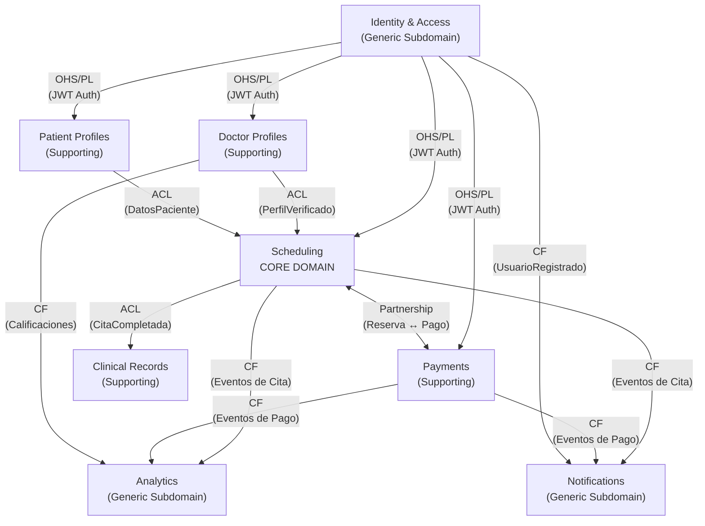

# 02 - Bounded Contexts
Healthcare Scheduling System

## Introducción

Este documento descompone el dominio del sistema usando Domain-Driven Design (DDD). Se identificaron **8 bounded contexts**, cada uno con una responsabilidad de negocio cohesiva, entidades propias y eventos de dominio bien definidos. Los contextos se comunican mediante patrones de integración explícitos para evitar el acoplamiento estructural.

### Patrones de Integración Utilizados

| Patrón | Sigla | Descripción |
|---|---|---|
| Open Host Service / Published Language | OHS/PL | El contexto upstream expone una API pública estable con un lenguaje publicado que todos los demás contextos consumen de forma estandarizada. |
| Anti-Corruption Layer | ACL | El contexto downstream traduce el modelo del upstream al suyo propio mediante una capa de traducción, protegiéndose de cambios o inconsistencias del modelo externo. |
| Conformist | CF | El downstream adopta el modelo del upstream sin transformación, aceptando la dependencia directa. Se aplica cuando el costo de traducción no justifica la protección. |
| Partnership | SK (Partnership) | Dos contextos coordinan sus cambios juntos de forma bidireccional, no hay una relación clara upstream/downstream, ambos se afectan mutuamente. |

### Agrupación por Tipo de Subdominio

| Tipo | Contextos |
|---|---|
| **Core Domain** | Scheduling |
| **Supporting Subdomains** | Doctor Profiles, Patient Profiles, Clinical Records, Payments |
| **Generic Subdomains** | Identity & Access, Notifications, Analytics |

---

## BC-01: Gestión de Identidad y Acceso (Identity & Access)

**Propósito:** Gestiona el registro, autenticación y autorización de todos los usuarios del sistema (pacientes, médicos, recepcionistas, administradores). Es la puerta de entrada a cualquier funcionalidad del sistema.

### Entidades Principales

| Entidad | Campos Clave | Restricciones |
|---|---|---|
| `Usuario` | `id: UUID`, `email: string`, `passwordHash: string`, `rol: Enum(PACIENTE, MÉDICO, RECEPCIONISTA, ADMIN)`, `estadoCuenta: Enum(ACTIVO, SUSPENDIDO, PENDIENTE_VERIFICACIÓN)`, `creadoEn: DateTime` | Email único, password mínimo 8 caracteres |
| `Sesion` | `id: UUID`, `usuarioId: UUID`, `tokenAcceso: string`, `tokenRefresco: string`, `expiraEn: DateTime`, `ip: string` | Un usuario puede tener múltiples sesiones activas |
| `VerificacionEmail` | `id: UUID`, `usuarioId: UUID`, `token: string`, `expiraEn: DateTime`, `usado: boolean` | Token de un solo uso, expira en 24h |

### Eventos de Dominio Publicados

| Evento | Descripción |
|---|---|
| `UsuarioRegistrado` | Se emite cuando un nuevo usuario completa el registro en el sistema. |
| `UsuarioVerificado` | Se emite cuando el usuario confirma su dirección de correo electrónico. |
| `SesiónIniciada` | Se emite al autenticarse exitosamente en el sistema. |
| `ContraseñaRestablecida` | Se emite cuando el usuario completa el flujo de recuperación de contraseña. |
| `CuentaSuspendida` | Se emite cuando un administrador suspende una cuenta de usuario. |

### Eventos de Dominio Consumidos
Este contexto es upstream de casi todos los demás; no depende de eventos externos.

### Relaciones con Otros Contextos

**Contextos Upstream:** *(ninguno)*

**Contextos Downstream:** Perfiles Médicos, Perfiles de Pacientes, Agendamiento, Pagos, Notificaciones

### Patrón de Integración

**OHS/PL** (Open Host Service / Published Language): Expone una API pública de autenticación con tokens JWT que todos los demás contextos consumen. El contrato de autenticación está publicado y es estable.

---

## BC-02: Perfiles Médicos (Doctor Profiles)

**Propósito:** Administra la información profesional de los médicos: especialidades, credenciales, tarifas y disponibilidad base. Permite que los pacientes descubran y evalúen a los profesionales de salud.

### Entidades Principales

| Entidad | Campos Clave | Restricciones |
|---|---|---|
| `PerfilMedico` | `id: UUID`, `usuarioId: UUID`, `nombreCompleto: string`, `cédulaProfesional: string`, `especialidades: string[]`, `añosExperiencia: int`, `descripción: string`, `fotoUrl: string`, `estadoVerificación: Enum(PENDIENTE, VERIFICADO, RECHAZADO)` | Cédula profesional única, mínimo 1 especialidad |
| `Especialidad` | `id: UUID`, `nombre: string`, `categoría: string`, `descripción: string` | Catálogo global normalizado |
| `CalificaciónMédico` | `id: UUID`, `médicoId: UUID`, `pacienteId: UUID`, `puntuación: int(1-5)`, `comentario: string`, `citaId: UUID`, `creadoEn: DateTime` | Una calificación por cita completada |
| `TarifaConsulta` | `id: UUID`, `médicoId: UUID`, `tipoConsulta: Enum(PRESENCIAL, VIRTUAL)`, `monto: Decimal`, `moneda: string` | Monto positivo, moneda |

### Eventos de Dominio Publicados

| Evento | Descripción |
|---|---|
| `PerfilMedicoCreado` | Se emite cuando un médico completa la creación de su perfil profesional. |
| `MedicoVerificado` | Se emite cuando un administrador valida las credenciales del médico. |
| `CalificacionRegistrada` | Se emite cuando un paciente registra una calificación tras una cita completada. |
| `TarifaActualizada` | Se emite cuando el médico modifica las tarifas de sus tipos de consulta. |

### Eventos de Dominio Consumidos

| Evento | Origen | Reacción |
|---|---|---|
| `UsuarioRegistrado` | Identity & Access | Inicializa el perfil médico con los datos base del usuario recién registrado. |
| `CitaCompletada` | Scheduling | Habilita al paciente para registrar una calificación para ese médico. |

### Relaciones con Otros Contextos

**Contextos Upstream:** Identity & Access

**Contextos Downstream:** Agendamiento, Analítica

### Patrón de Integración

**ACL** (Anti-Corruption Layer): Al consumir eventos de Identity & Access, este contexto traduce el modelo genérico de usuario al modelo específico de perfil médico, protegiéndose de cambios en el modelo de identidad.

---

## BC-03: Perfiles de Pacientes (Patient Profiles)

**Propósito:** Gestiona la información personal y de salud relevante de los pacientes: datos demográficos, historial médico resumido, contactos de emergencia y preferencias de comunicación.

### Entidades Principales

| Entidad | Campos Clave | Restricciones |
|---|---|---|
| `PerfilPaciente` | `id: UUID`, `usuarioId: UUID`, `nombreCompleto: string`, `fechaNacimiento: Date`, `género: Enum(M, F, OTRO)`, `teléfono: string`, `seguroMédico: string`, `grupoSanguíneo: Enum` | Fecha de nacimiento debe ser en el pasado |
| `ContactoEmergencia` | `id: UUID`, `pacienteId: UUID`, `nombre: string`, `relación: string`, `teléfono: string` | Al menos un contacto requerido por paciente |
| `CondiciónMedica` | `id: UUID`, `pacienteId: UUID`, `nombre: string`, `tipo: Enum(CRÓNICA, ALERGIA, ANTECEDENTE)`, `notas: string`, `registradoEn: DateTime` | Solo visible para el paciente y médicos autorizados |

### Eventos de Dominio Publicados

| Evento | Descripción |
|---|---|
| `PerfilPacienteCreado` | Se emite cuando un paciente completa la creación de su perfil. |
| `PerfilActualizado` | Se emite cuando el paciente modifica datos personales relevantes. |
| `CondicionMedicaAgregada` | Se emite cuando se registra una nueva condición, alergia o antecedente médico. |

### Eventos de Dominio Consumidos

| Evento | Origen | Reacción |
|---|---|---|
| `UsuarioRegistrado` | Identity & Access | Inicializa el perfil del paciente con los datos base del usuario recién registrado. |

### Relaciones con Otros Contextos

**Contextos Upstream:** Identity & Access

**Contextos Downstream:** Agendamiento, Notificaciones

### Patrón de Integración

**ACL** (Anti-Corruption Layer): Al consumir eventos de Identity & Access, este contexto traduce el modelo genérico de usuario al modelo específico de perfil de paciente, aislando el dominio clínico-demográfico de los cambios en el modelo de identidad.

---

## BC-04: Agendamiento de Citas (Scheduling)

**Propósito:** Es el core domain del sistema. Gestiona la disponibilidad de los médicos, el ciclo de vida completo de las citas (solicitud, confirmación, cancelación, reprogramación) y las reglas de negocio asociadas.

### Entidades Principales

| Entidad | Campos Clave | Restricciones |
|---|---|---|
| `Disponibilidad` | `id: UUID`, `médicoId: UUID`, `díaSemana: Enum(LUN..DOM)`, `horaInicio: Time`, `horaFin: Time`, `duración: int(minutos)`, `activo: boolean` | Franjas no solapadas por médico |
| `BloqueoAgenda` | `id: UUID`, `médicoId: UUID`, `fechaInicio: DateTime`, `fechaFin: DateTime`, `motivo: string` | Prevalece sobre la disponibilidad regular |
| `Cita` | `id: UUID`, `pacienteId: UUID`, `médicoId: UUID`, `fechaHora: DateTime`, `duración: int`, `tipo: Enum(PRESENCIAL, VIRTUAL)`, `estado: Enum(SOLICITADA, CONFIRMADA, CANCELADA, COMPLETADA, NO_ASISTIÓ)`, `motivoConsulta: string`, `creadoEn: DateTime` | Estado sigue máquina de estados definida |
| `SlotDisponible` | `id: UUID`, `médicoId: UUID`, `fechaHora: DateTime`, `disponible: boolean` | Proyección calculada de disponibilidad |

### Eventos de Dominio Publicados

| Evento | Descripción |
|---|---|
| `CitaSolicitada` | Se emite cuando un paciente solicita una cita con un médico. |
| `CitaConfirmada` | Se emite cuando la cita queda confirmada tras la validación del pago. |
| `CitaCancelada` | Se emite cuando una cita es cancelada por el paciente, el médico o el sistema. |
| `CitaReprogramada` | Se emite cuando se modifica la fecha u hora de una cita existente. |
| `CitaCompletada` | Se emite cuando el médico marca la consulta como realizada. |
| `CitaMarcadaNoAsistio` | Se emite cuando el paciente no se presentó a la cita programada. |

### Eventos de Dominio Consumidos

| Evento | Origen | Reacción |
|---|---|---|
| `MedicoVerificado` | Doctor Profiles | Habilita la creación de agenda y slots de disponibilidad para ese médico. |
| `PagoConfirmado` | Payments | Transiciona la cita del estado SOLICITADA a CONFIRMADA. |
| `PagoFallido` | Payments | Revierte la reserva del slot y libera la disponibilidad del médico. |

### Relaciones con Otros Contextos

**Contextos Upstream:** Identity & Access, Doctor Profiles, Patient Profiles, Payments

**Contextos Downstream:** Notificaciones, Pagos, Analítica, Historial Clínico

### Patrón de Integración

**Partnership** con Payments: Coordinación estrecha y bidireccional ya que Scheduling emite `CitaSolicitada` para que Payments cree la orden, y Payments responde con `PagoConfirmado` o `PagoFallido` para que Scheduling confirme o revierta la reserva. Ambos contextos se afectan mutuamente y deben coordinarse en sus cambios.

---

## BC-05: Pagos (Payments)

**Propósito:** Gestiona el procesamiento de cobros por consultas, reembolsos por cancelaciones y el registro contable de todas las transacciones financieras. Actúa como intermediario entre el sistema y la pasarela de pago externa.

### Entidades Principales

| Entidad | Campos Clave | Restricciones |
|---|---|---|
| `Orden` | `id: UUID`, `citaId: UUID`, `pacienteId: UUID`, `monto: Decimal`, `moneda: string`, `estado: Enum(PENDIENTE, COMPLETADA, FALLIDA, REEMBOLSADA)`, `creadoEn: DateTime` | Monto positivo, estado sigue máquina de estados |
| `Transacción` | `id: UUID`, `ordenId: UUID`, `proveedorPago: string`, `referenciaProv: string`, `tipo: Enum(COBRO, REEMBOLSO)`, `monto: Decimal`, `estadoProv: string`, `procesadoEn: DateTime` | Referencia externa única por transacción |
| `MétodoPago` | `id: UUID`, `pacienteId: UUID`, `tipo: Enum(TARJETA, TRANSFERENCIA)`, `últimosCuatro: string`, `tokenProv: string`, `predeterminado: boolean` | Token nunca almacena datos RAW de tarjeta |

### Eventos de Dominio Publicados

| Evento | Descripción |
|---|---|
| `OrdenCreada` | Se emite cuando se genera una orden de cobro vinculada a una cita solicitada. |
| `PagoConfirmado` | Se emite cuando la pasarela de pago confirma exitosamente el cobro. |
| `PagoFallido` | Se emite cuando la pasarela de pago rechaza o falla el procesamiento del cobro. |
| `ReembolsoIniciado` | Se emite cuando se aprueba un reembolso por cancelación de cita. |
| `ReembolsoCompletado` | Se emite cuando la pasarela de pago confirma la devolución de fondos al paciente. |

### Eventos de Dominio Consumidos

| Evento | Origen | Reacción |
|---|---|---|
| `CitaSolicitada` | Scheduling | Crea una orden de cobro pendiente por el monto de la consulta. |
| `CitaCancelada` | Scheduling | Evalúa la política de reembolso aplicable e inicia el proceso si corresponde. |

### Relaciones con Otros Contextos

**Contextos Upstream:** Scheduling, Identity & Access

**Contextos Downstream:** Notificaciones, Analítica

### Patrón de Integración

**ACL** frente al proveedor de pago externo (Stripe/PayPal): Traduce el modelo del proveedor externo al modelo interno, protegiendo al sistema de cambios en la API del proveedor. 

**Partnership** con Scheduling: Coordinación bidireccional para confirmar o revertir citas según el resultado del pago.

---

## BC-06: Notificaciones (Notifications)

**Propósito:** Envía comunicaciones a los usuarios (confirmaciones, recordatorios, alertas de pago) a través de múltiples canales: email, SMS y notificaciones push. Gestiona las preferencias de comunicación y el historial de envíos.

### Entidades Principales

| Entidad | Campos Clave | Restricciones |
|---|---|---|
| `Notificacion` | `id: UUID`, `destinatarioId: UUID`, `canal: Enum(EMAIL, SMS, PUSH)`, `tipo: Enum(CONFIRMACIÓN_CITA, RECORDATORIO, PAGO, CANCELACIÓN)`, `asunto: string`, `cuerpo: string`, `estado: Enum(PENDIENTE, ENVIADA, FALLIDA)`, `enviadoEn: DateTime` | Reintentos máximo 3 en caso de fallo |
| `PreferenciaNotificacion` | `id: UUID`, `usuarioId: UUID`, `canal: Enum`, `tipo: Enum`, `habilitado: boolean` | Por defecto todos los canales habilitados |
| `PlantillaMensaje` | `id: UUID`, `tipo: Enum`, `canal: Enum`, `idioma: string`, `asunto: string`, `cuerpoTemplate: string` | Soporte multiidioma |

### Eventos de Dominio Publicados

| Evento | Descripción |
|---|---|
| `NotificacionEnviada` | Se emite cuando el mensaje es entregado exitosamente al canal correspondiente. |
| `NotificacionFallida` | Se emite cuando el envío falla tras agotar los reintentos configurados. |

### Eventos de Dominio Consumidos

| Evento | Origen | Reacción |
|---|---|---|
| `UsuarioRegistrado` | Identity & Access | Envía el correo de bienvenida al nuevo usuario. |
| `CitaConfirmada` | Scheduling | Envía confirmación de cita al paciente y al médico. |
| `CitaCancelada` | Scheduling | Notifica la cancelación a los involucrados con el motivo correspondiente. |
| `CitaReprogramada` | Scheduling | Notifica el cambio de fecha/hora al paciente y al médico. |
| `PagoConfirmado` | Payments | Envía el comprobante de pago al paciente. |
| `PagoFallido` | Payments | Alerta al paciente sobre el fallo en el procesamiento del pago. |

### Relaciones con Otros Contextos

**Contextos Upstream:** Identity & Access, Scheduling, Payments

**Contextos Downstream:** *(ninguno)*

### Patrón de Integración

**CF** (Conformist): Consume eventos tal como los publican los contextos upstream sin transformación compleja. Al ser un contexto de soporte genérico, la dependencia directa del modelo upstream es aceptable y el costo de una ACL no se justifica.

---

## BC-07: Historial Clínico (Clinical Records)

**Propósito:** Almacena y gestiona las notas clínicas, diagnósticos, prescripciones y documentos generados durante las consultas. Garantiza la privacidad, trazabilidad y acceso controlado a la información médica.

### Entidades Principales

| Entidad | Campos Clave | Restricciones |
|---|---|---|
| `RegistroClinico` | `id: UUID`, `citaId: UUID`, `pacienteId: UUID`, `médicoId: UUID`, `notasSubjetivas: string`, `diagnóstico: string`, `codigoCIE10: string`, `plan: string`, `creadoEn: DateTime`, `firmadoEn: DateTime` | Solo el médico tratante puede crear/editar hasta firmarlo |
| `Prescripcion` | `id: UUID`, `registroId: UUID`, `medicamento: string`, `dosis: string`, `frecuencia: string`, `duración: string`, `indicaciones: string` | Vinculada a un registro clínico firmado |
| `DocumentoAdjunto` | `id: UUID`, `registroId: UUID`, `nombre: string`, `tipo: Enum(LABORATORIO, IMAGEN, OTRO)`, `urlArchivo: string`, `subidoPor: UUID`, `subidoEn: DateTime` | Máximo 20 MB por archivo |

### Eventos de Dominio Publicados

| Evento | Descripción |
|---|---|
| `RegistroClínicoCreado` | Se emite cuando el médico abre un nuevo registro para una cita completada. |
| `RegistroFirmado` | Se emite cuando el médico firma digitalmente el registro, haciéndolo inmutable. |
| `PrescripciónEmitida` | Se emite cuando se agrega una prescripción a un registro firmado. |

### Eventos de Dominio Consumidos

| Evento | Origen | Reacción |
|---|---|---|
| `CitaCompletada` | Scheduling | Habilita al médico para crear el registro clínico correspondiente a esa cita. |

### Relaciones con Otros Contextos

**Contextos Upstream:** Scheduling

**Contextos Downstream:** *(ninguno)*

### Patrón de Integración

**ACL** (Anti-Corruption Layer): Al consumir eventos de Scheduling, este contexto traduce el modelo de agendamiento al modelo clínico, protegiendo la integridad del historial médico de cambios en el dominio de citas.

---

## BC-08: Analítica y Reportes (Analytics)

**Propósito:** Consolida métricas operacionales y de negocio para administradores de clínica y médicos: tasas de ocupación, ingresos, patrones de cancelación y satisfacción de pacientes. Es un contexto de **solo lectura** (no modifica datos de otros contextos).

### Entidades Principales

| Entidad | Campos Clave | Restricciones |
|---|---|---|
| `MetricaCita` | `id: UUID`, `médicoId: UUID`, `fecha: Date`, `totalSolicitadas: int`, `totalCompletadas: int`, `totalCanceladas: int`, `totalNoAsistió: int` | Agregado diario, inmutable una vez consolidado |
| `MetricaIngreso` | `id: UUID`, `médicoId: UUID`, `período: string`, `totalBruto: Decimal`, `totalReembolsado: Decimal`, `neto: Decimal` | Calculado a partir de eventos de Payments |
| `ReportePeriodico` | `id: UUID`, `clínicaId: UUID`, `tipo: Enum(SEMANAL, MENSUAL)`, `generadoEn: DateTime`, `urlArchivo: string` | Generado automáticamente al cierre del período |

### Eventos de Dominio Publicados

| Evento | Descripción |
|---|---|
| `ReporteGenerado` | Se emite cuando se consolida y publica un reporte periódico para una clínica. |

### Eventos de Dominio Consumidos

| Evento | Origen | Reacción |
|---|---|---|
| `CitaCompletada` | Scheduling | Incrementa el contador de citas completadas en las métricas del médico. |
| `CitaCancelada` | Scheduling | Incrementa el contador de cancelaciones y registra el motivo si está disponible. |
| `CitaMarcadaNoAsistió` | Scheduling | Registra la inasistencia en las métricas de ocupación del médico. |
| `PagoConfirmado` | Payments | Acumula el ingreso bruto en las métricas financieras del período. |
| `ReembolsoCompletado` | Payments | Descuenta del ingreso neto el monto reembolsado en el período correspondiente. |
| `CalificacionRegistrada` | Doctor Profiles | Actualiza el promedio de satisfacción del médico en las métricas de calidad. |

### Relaciones con Otros Contextos

**Contextos Upstream:** Scheduling, Payments, Doctor Profiles

**Contextos Downstream:** *(ninguno)*

### Patrón de Integración

**CF** (Conformist): Consume eventos de múltiples contextos upstream y los proyecta en modelos de lectura propios optimizados para reportes. La dependencia directa es aceptable dado que Analytics no tiene lógica de negocio crítica que proteger.

---

## Context Map

