# 04 - Flujos de Datos e Interacciones
Healthcare scheduling system

## Introducción

Este documento describe los flujos end-to-end más representativos del sistema. Cada flujo incluye el escenario de negocio, un diagrama de secuencia con los módulos involucrados, el flujo ideal (*happy path*) y al menos un camino de fallo o compensación.

Los flujos se trazan a nivel de módulos internos del monolito modular, reflejando la comunicación síncrona (llamadas directas vía HTTP o Application Service) y la comunicación asíncrona (eventos publicados al bus de eventos interno).

### Convenciones del Diagrama

| Notación | Significado |
|---|---|
| `-->>`  | Llamada síncrona (HTTP / llamada directa entre capas) |
| `-->>`  | Respuesta síncrona |
| `--)` | Publicación asíncrona al bus de eventos |
| `Note` | Acción interna relevante al flujo |

---

## Flujo 1: Registro y Verificación de Cuenta

### Escenario de Negocio

Un nuevo usuario (paciente) se registra en la plataforma. El sistema crea su cuenta, envía un correo de verificación y, al confirmar su email, inicializa automáticamente su perfil de paciente listo para agendar citas.

---

### Happy Path

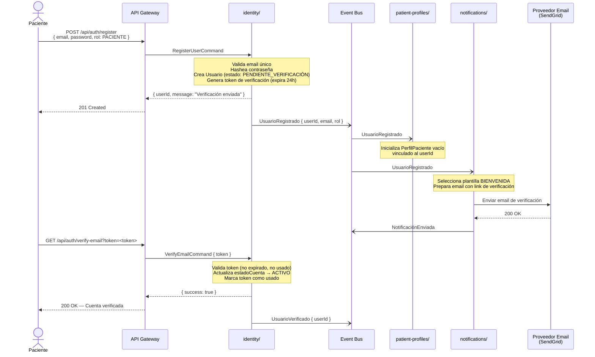

---

### Camino de Fallo: Token de Verificación Expirado

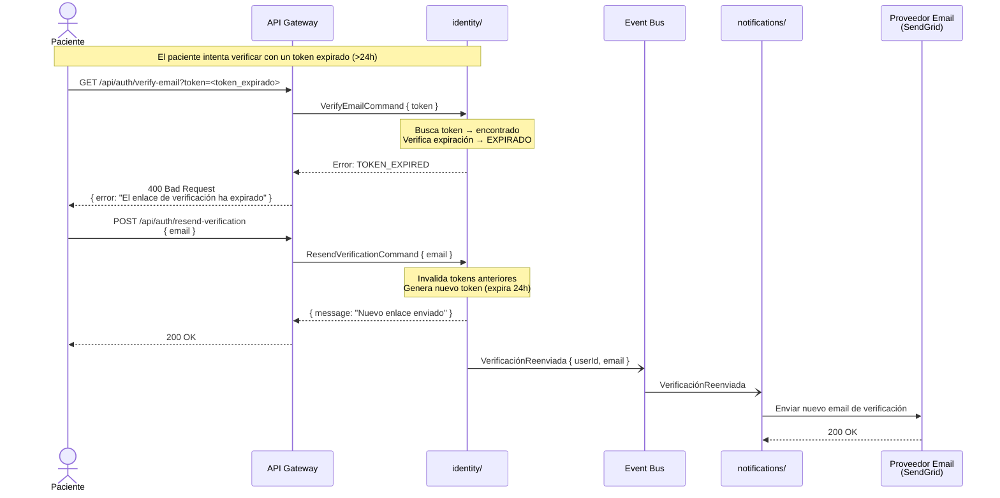

---

## Flujo 2: Agendamiento y Pago de Cita

### Escenario de Negocio

Un paciente autenticado selecciona un médico, elige un espacio disponible, confirma la cita y realiza el pago. Este es el flujo core del sistema: involucra coordinación entre Scheduling y Payments bajo el patrón Partnership, donde la cita solo se confirma si el pago es exitoso.

---

### Happy Path

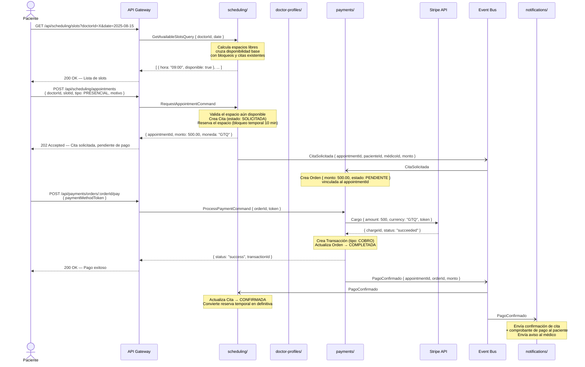

---

### Camino de Fallo: Pago Rechazado por la Pasarela

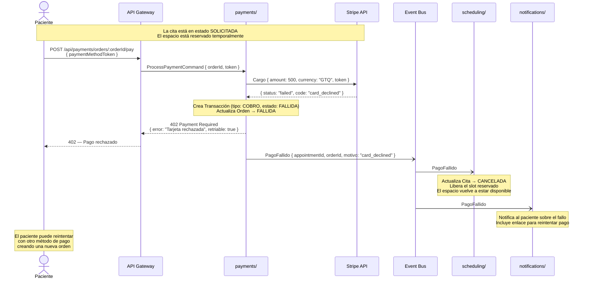

---

### Camino de Fallo: Espacio Ocupado en el Momento de Confirmar

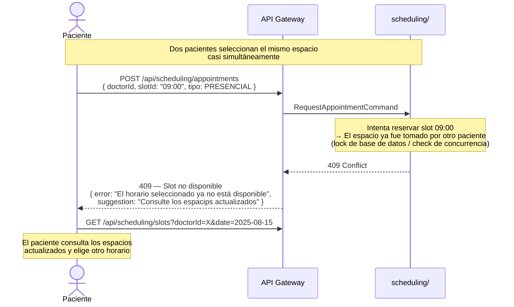

---

## Flujo 3: Cancelación de Cita con Reembolso

### Escenario de Negocio

Un paciente cancela una cita previamente confirmada con más de 24 horas de anticipación. El sistema cancela la cita, libera el espacio del médico y procesa el reembolso completo al método de pago original del paciente.

---

### Happy Path

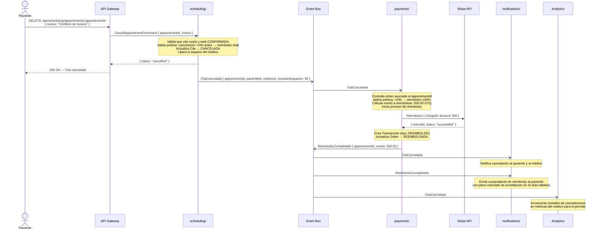

---

### Camino de Fallo: Cancelación Tardía (Sin Derecho a Reembolso)

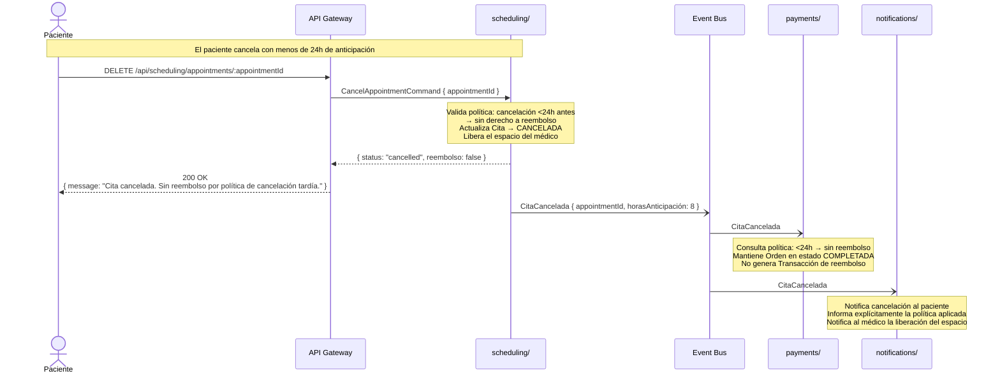

---

### Camino de Fallo: Reembolso Fallido en Stripe

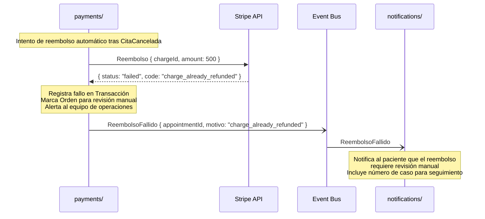

---

## Flujo 4: Consulta Completada y Creación de Historial Clínico

### Escenario de Negocio

El médico atiende al paciente, finaliza la consulta y crea el registro clínico correspondiente, incluyendo diagnóstico, notas clínicas y prescripción. Al firmar el registro, este queda inmutable. El flujo también actualiza las métricas de analítica del sistema.

---

### Happy Path

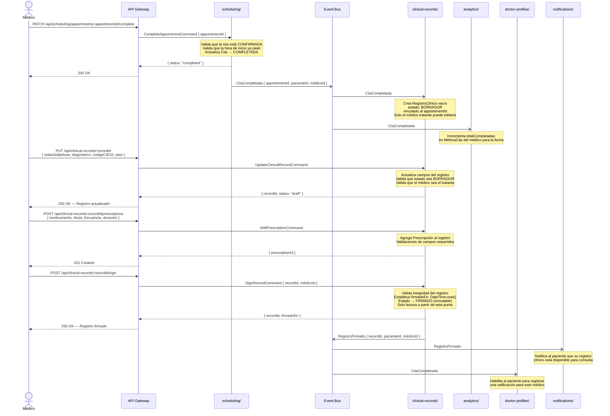

---

### Camino de Fallo: Intento de Modificar un Registro ya Firmado

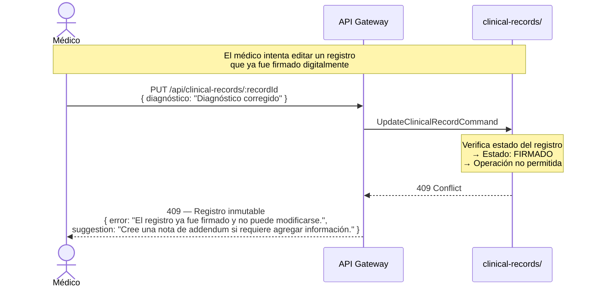

---

### Camino de Fallo: Médico No Autorizado Intenta Acceder al Registro

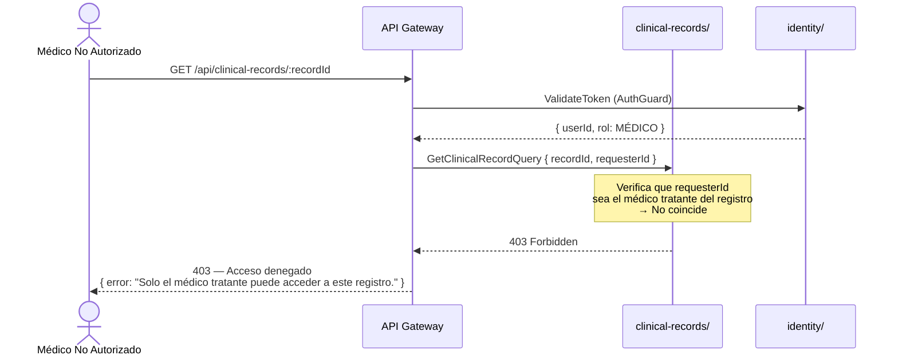

---

## Resumen de Flujos

| Flujo | Módulos Involucrados | Tipo de Comunicación | Patrones Aplicados |
|---|---|---|---|
| Registro y verificación | Identity, PatientProfiles, Notifications | Síncrona + Asíncrona | OHS/PL (JWT), ACL (perfil) |
| Agendamiento y pago | Scheduling, Payments, Notifications | Síncrona + Asíncrona | Partnership (Scheduling ↔ Payments) |
| Cancelación y reembolso | Scheduling, Payments, Notifications, Analytics | Asíncrona dominante | Partnership, CF |
| Consulta y registro clínico | Scheduling, ClinicalRecords, DoctorProfiles, Analytics, Notifications | Asíncrona dominante | ACL (ClinicalRecords ← Scheduling) |
