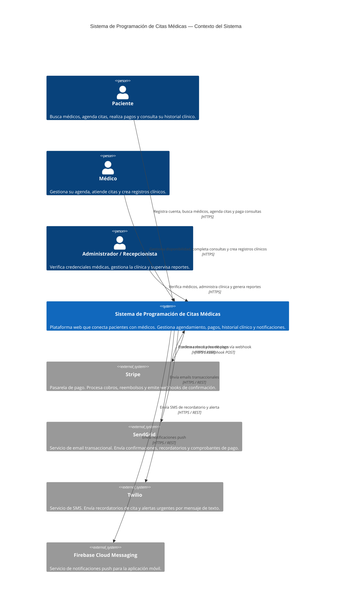

# Diagrama 1 — Contexto del Sistema (C4 Nivel 1)

## Sistema de Programación de Citas Médicas

---

## Diagrama

---

## Explicación

Este diagrama representa el **nivel 1 del modelo C4**: el sistema completo como una única caja negra, rodeado por los actores humanos y los sistemas externos con los que se integra.

### Actores Humanos

El sistema atiende a tres roles diferenciados. El **Paciente** es el usuario principal: busca médicos por especialidad, revisa disponibilidad, agenda citas y realiza el pago en línea. El **Médico** gestiona su propia agenda de disponibilidad, marca citas como completadas y redacta los registros clínicos correspondientes. El **Administrador / Recepcionista** verifica las credenciales profesionales de los médicos antes de que puedan operar en la plataforma, y accede a los reportes operacionales y financieros de la clínica.

### Sistemas Externos

**Stripe** es la pasarela de pago principal. El sistema le envía solicitudes de cobro y reembolso vía REST, y Stripe responde con el resultado final a través de webhooks hacia el endpoint `/api/payments/webhook`. La comunicación es bidireccional y asíncrona en el caso de los webhooks.

**SendGrid** recibe solicitudes REST del sistema para el envío de correos transaccionales: bienvenida al registrarse, confirmación de cita, comprobante de pago, aviso de cancelación y recordatorios programados 24 horas antes de la consulta.

**Twilio** complementa el canal de email con SMS para recordatorios de cita. Se usa especialmente para usuarios que no tienen la aplicación instalada o que prefieren comunicación directa por mensaje de texto.

**Firebase Cloud Messaging (FCM)** gestiona las notificaciones push hacia la aplicación móvil, permitiendo alertas en tiempo real cuando la cita es confirmada, cuando se aproxima la fecha o cuando ocurre un cambio en el estado de la cita.

### Decisiones de Diseño Notables

- El sistema **no expone datos clínicos a ningún sistema externo**. Stripe, SendGrid y Twilio solo reciben los datos mínimos necesarios para cumplir su función (monto, email de destinatario, número de teléfono).
- Los **webhooks de Stripe** entran por un endpoint dedicado con validación de firma (`Stripe-Signature`), lo que previene solicitudes maliciosas que intenten simular confirmaciones de pago falsas.
- La elección de **tres canales de notificación independientes** (email, SMS, push) garantiza que los recordatorios lleguen al usuario incluso si uno de los canales falla, respetando las preferencias configuradas por cada usuario.
