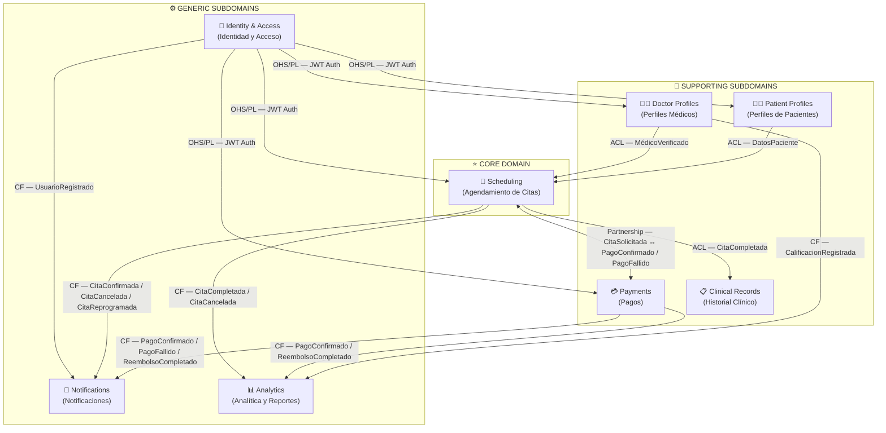

# Diagrama 2 — Mapa de Contextos (DDD Context Map)

## Sistema de Programación de Citas Médicas

---

## Diagrama

---

## Leyenda de Patrones de Integración

| Patrón | Sigla | Significado en este sistema |
|---|---|---|
| **Open Host Service / Published Language** | OHS/PL | Identity & Access expone una API pública estable de autenticación con tokens JWT. Todos los contextos consumen este contrato sin necesidad de adaptarlo. |
| **Anti-Corruption Layer** | ACL | El contexto receptor traduce el modelo del upstream al suyo propio mediante una capa de traducción. Protege la integridad del modelo de dominio receptor. |
| **Conformist** | CF | El contexto receptor adopta el modelo del upstream directamente, sin transformación. Se aplica cuando el costo de una ACL no justifica la protección adicional. |
| **Partnership** | Partnership | Coordinación bidireccional entre Scheduling y Payments. Ambos contextos se afectan mutuamente y deben coordinar cambios. No hay un upstream/downstream claro. |

---

## Agrupación por Tipo de Subdominio

### ⭐ Core Domain — *Scheduling*

El agendamiento de citas es la **capacidad diferenciadora del negocio**. Ninguna otra solución genérica puede reemplazarlo porque contiene las reglas específicas de disponibilidad médica, las políticas de cancelación, la máquina de estados de las citas y la lógica de reserva concurrente. Todo el sistema existe para servir a este contexto.

### 🔧 Supporting Subdomains

Estos contextos **soportan directamente al core domain** pero no son el diferenciador principal del negocio:

- **Doctor Profiles**: Gestiona el catálogo de médicos y sus credenciales. Sin médicos verificados, Scheduling no puede crear agendas.
- **Patient Profiles**: Centraliza los datos del paciente necesarios para el agendamiento y el historial clínico.
- **Payments**: Maneja el flujo financiero. La confirmación de citas depende de pagos exitosos (Partnership con Scheduling).
- **Clinical Records**: Preserva la información médica generada en cada consulta. Protege su modelo con ACL frente a Scheduling.

### ⚙️ Generic Subdomains

Resuelven problemas comunes que no son exclusivos de este negocio. Podrían ser reemplazados por soluciones de mercado sin afectar la lógica core:

- **Identity & Access**: Autenticación y autorización. Podría sustituirse por Auth0 o Cognito sin cambiar el resto del sistema.
- **Notifications**: Envío de mensajes por múltiples canales. Patrón Conformist porque no tiene lógica de negocio propia que proteger.
- **Analytics**: Proyecciones de métricas de solo lectura. Consume eventos de otros contextos sin modificar su estado.

---

## Relaciones Clave

| Relación | Patrón | Justificación |
|---|---|---|
| IAM → todos | OHS/PL | Identity publica un contrato JWT estable. Cambiar el mecanismo de auth no debe requerir cambios en los consumidores. |
| DP → SCH | ACL | Scheduling necesita datos del médico (disponibilidad, tarifa) pero no debe acoplarse al modelo de perfil. La ACL traduce entre modelos. |
| PP → SCH | ACL | Scheduling necesita datos del paciente pero protege su modelo de agendamiento de cambios en el dominio demográfico. |
| SCH ↔ PAY | Partnership | La confirmación de cita y el resultado del pago están inevitablemente acoplados. Ambos contextos deben coordinarse en sus cambios de modelo. |
| SCH → CR | ACL | Clinical Records protege su modelo clínico estricto de los cambios en el modelo de agendamiento mediante una capa de traducción. |
| PAY → externos | ACL | Stripe y SendGrid/Twilio tienen sus propios modelos que se traducen al modelo interno mediante adaptadores (ACL). |
