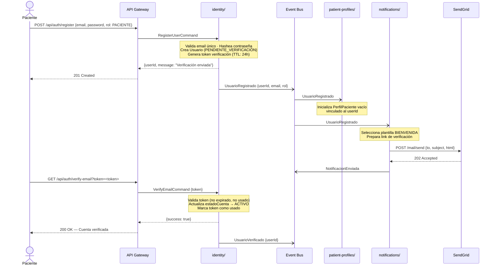
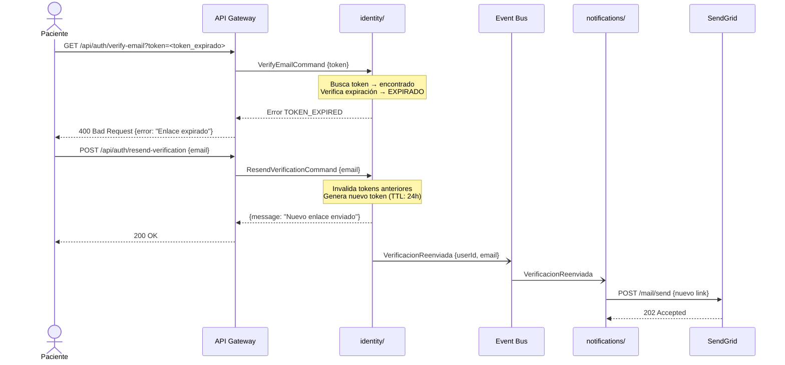
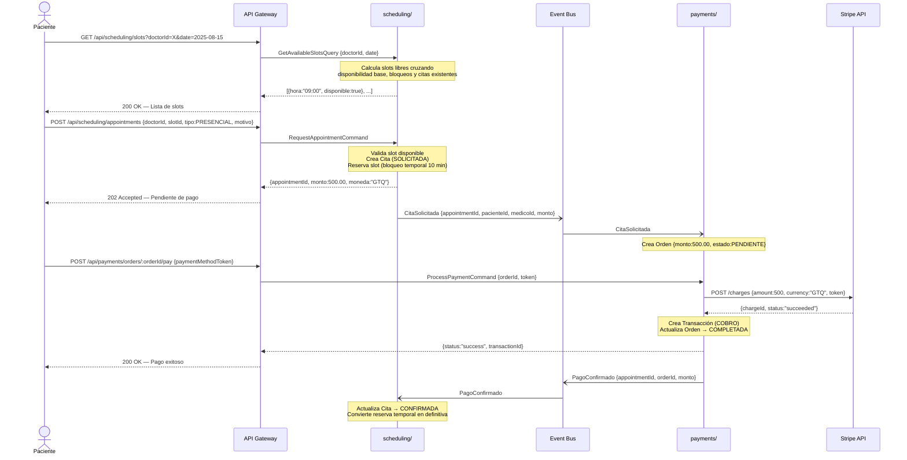
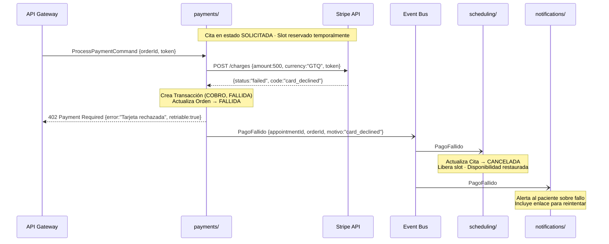
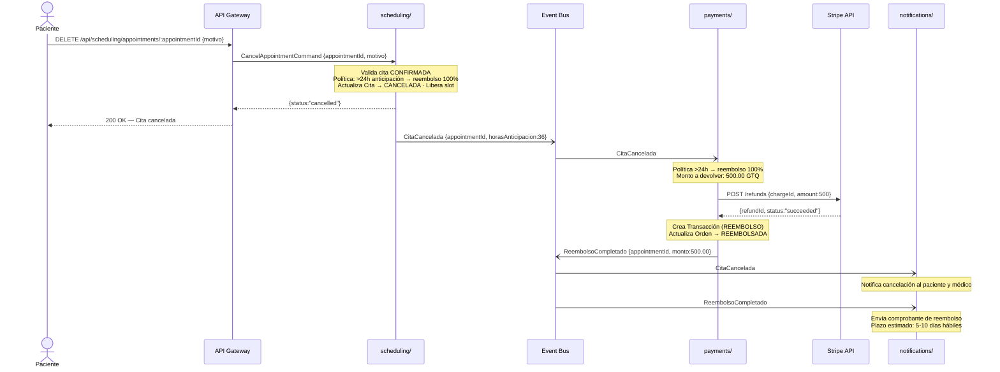
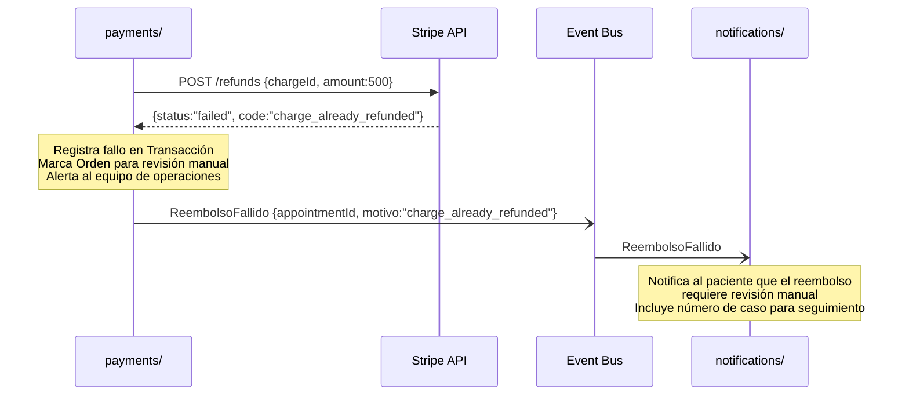

# Diagrama 3 — Diagramas de Secuencia (Flujos de Datos)

## Sistema de Programación de Citas Médicas

---

## Convenciones

| Notación | Significado |
|---|---|
| `–>>` | Llamada síncrona (HTTP REST o llamada directa entre capas) |
| `-->>` | Respuesta síncrona |
| `-)` | Publicación asíncrona al bus de eventos interno |
| `Note` | Lógica interna relevante al flujo |

---

## Flujo A — Registro y Verificación de Cuenta (Happy Path)

**Escenario:** Un nuevo paciente se registra en la plataforma. El sistema crea su cuenta, envía un correo de verificación y, al confirmar su email, inicializa automáticamente su perfil de paciente.

---

## Flujo A — Fallo: Token de Verificación Expirado

**Escenario:** El paciente intenta verificar su cuenta con un enlace que ya caducó (más de 24 horas).

---

## Flujo B — Agendamiento y Pago de Cita (Happy Path)

**Escenario:** Un paciente autenticado selecciona un médico, elige un slot disponible, solicita la cita y realiza el pago. La cita solo se confirma si el pago es exitoso (patrón Partnership entre Scheduling y Payments).

---

## Flujo B — Fallo: Pago Rechazado por Stripe

**Escenario:** La tarjeta del paciente es rechazada. El sistema revierte la reserva del slot y libera la disponibilidad del médico.

---

## Flujo C — Cancelación con Reembolso (Happy Path)

**Escenario:** Un paciente cancela una cita confirmada con más de 24 horas de anticipación. El sistema cancela la cita, libera el slot y procesa el reembolso completo vía Stripe.

---

## Flujo C — Fallo: Reembolso Fallido en Stripe

**Escenario:** Stripe rechaza el reembolso (ej. cargo ya reembolsado previamente). El sistema registra el fallo y escala a revisión manual.

---

## Resumen de Flujos Cubiertos

| Flujo | Happy Path | Fallo / Compensación | Comunicación |
|---|---|---|---|
| A — Registro y verificación | Registro + verificación email | Token expirado + reenvío | Síncrona + Asíncrona |
| B — Agendamiento y pago | Solicitud + pago + confirmación | Pago rechazado + reversión de slot | Síncrona + Asíncrona |
| C — Cancelación con reembolso |  Cancelación + reembolso Stripe | Reembolso fallido + escalación manual | Asíncrona dominante |
