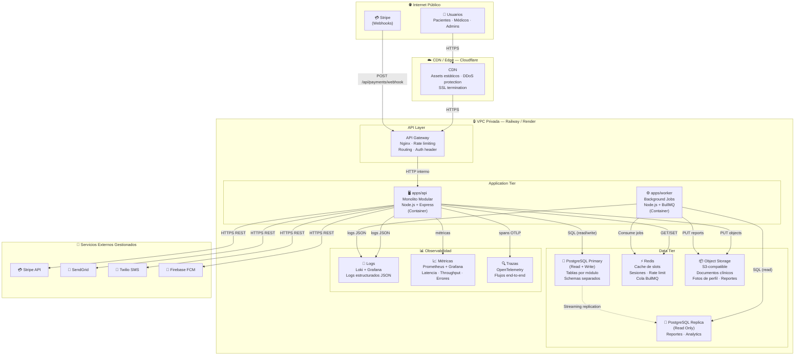

# Diagrama 4 — Despliegue e Infraestructura

## Sistema de Programación de Citas Médicas

---

## Diagrama

---

## Explicación de la Topología

### Zonas de Red

El sistema está organizado en tres zonas lógicas:

**Internet Público:** Todo el tráfico de usuarios llega primero a Cloudflare, que actúa como CDN y escudo DDoS. Los webhooks de Stripe también entran por esta capa, pero son enrutados directamente al endpoint dedicado con validación de firma.

**VPC Privada:** Contiene todos los componentes de aplicación y datos. Ningún data store es directamente accesible desde internet. El único punto de entrada es el API Gateway (Nginx), que aplica rate limiting, valida cabeceras de autenticación y enruta hacia el monolito.

**Servicios Externos Gestionados:** Stripe, SendGrid, Twilio y FCM son SaaS de terceros. El sistema les llama saliendo de la VPC vía HTTPS, pero nunca les abre puertos de entrada directa. Los únicos datos que reciben son los mínimos necesarios para su función.

---

### Componentes y Decisiones Clave

**API Gateway (Nginx)**
Centraliza el enrutamiento, aplica rate limiting por IP y por usuario autenticado, y valida que el header `Authorization` esté presente antes de pasar la solicitud al monolito. No ejecuta lógica de negocio.

**apps/api — Monolito Modular**
Un único proceso Node.js que aloja los 8 módulos de dominio. Escala horizontalmente añadiendo réplicas detrás del gateway. Comparte la misma instancia de PostgreSQL Primary para lectura y escritura. Lee de Redis para operaciones de caché (slots disponibles, sesiones) y escribe objetos en S3 para documentos clínicos y fotos de perfil.

**apps/worker — Background Jobs**
Proceso separado que comparte el código base pero solo instancia los módulos de Notifications y Analytics. Lee de la réplica de PostgreSQL (sin afectar el rendimiento del API) y consume jobs de la cola BullMQ en Redis. Ejecuta dos jobs principales: recordatorios de cita (cron horario) y generación de reportes periódicos (cron semanal). Si el worker se reinicia, los jobs pendientes en Redis no se pierden.

**PostgreSQL con réplica de lectura**
El Primary maneja todas las escrituras y lecturas de los módulos core (Scheduling, Payments, Identity). La Replica de solo lectura sirve exclusivamente a Analytics y al Worker, evitando que las consultas pesadas de reportes afecten la latencia del API principal.

**Redis**
Cumple tres roles simultáneos: caché de slots disponibles (TTL corto, alta frecuencia de lectura), almacenamiento de sesiones y tokens de rate limit, y cola de jobs para BullMQ (Worker). Usar un único Redis simplifica la operación inicial; puede separarse si el volumen lo requiere.

**Object Storage (S3-compatible)**
Almacena documentos clínicos adjuntos (PDFs de laboratorios, imágenes), fotos de perfil de médicos y reportes generados por Analytics. El monolito genera URLs firmadas con TTL corto para que los clientes descarguen directamente desde S3, sin pasar el binario por el API.

**Observabilidad**
Tres pilares independientes. Los **logs estructurados en JSON** se envían a Loki y se visualizan en Grafana. Las **métricas** (latencia de endpoints, tasa de errores, throughput de pagos) se exponen vía Prometheus y se grafican en Grafana. Las **trazas distribuidas** con OpenTelemetry capturan el flujo completo de una solicitud a través de los módulos, lo que facilita diagnosticar dónde se introduce latencia en flujos complejos como el de agendamiento + pago.

---

### Justificación de Decisiones Topológicas

| Decisión | Justificación |
|---|---|
| Monolito en un solo container | Consistente con ADR-001. Simplifica el despliegue y el escalado horizontal. |
| Worker como proceso separado | Aisla los jobs de fondo del ciclo de vida del API. Un job lento no bloquea solicitudes HTTP. |
| Réplica de lectura PostgreSQL | Protege el rendimiento del API de consultas analíticas pesadas sin necesidad de una base de datos separada por contexto. |
| Redis para cola y caché | Un único componente cumple dos roles críticos (caché de slots + cola de jobs), reduciendo la complejidad operativa inicial. |
| S3 para documentos clínicos | Los archivos binarios no deben pasar por el API ni almacenarse en PostgreSQL. S3 ofrece durabilidad, control de acceso por URL firmada y costos por GB muy bajos. |
| Cloudflare como CDN + DDoS | El sistema maneja datos de salud sensibles. Cloudflare añade protección de borde sin configuración compleja, con SSL termination gratuito. |
